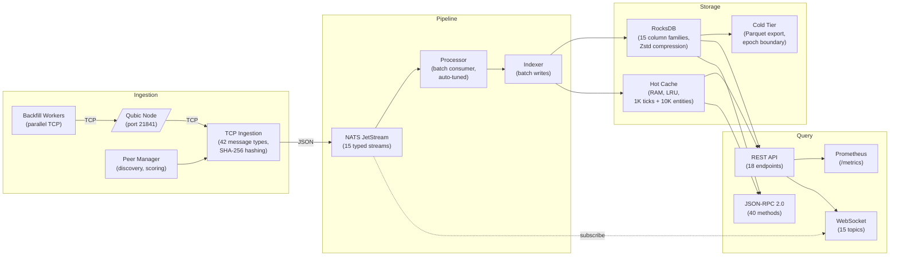

# Qonduit

**High-performance Qubic blockchain indexer and RPC server**

Qonduit connects to a Qubic node via TCP, decodes the binary protocol in real-time, indexes all blockchain data into RocksDB through a NATS JetStream pipeline, and serves it via REST API, JSON-RPC 2.0, and WebSocket subscriptions.

[](https://github.com/alez04/qonduit/actions/workflows/ci.yml)

## Architecture



## Features

- **TCP Ingestion**: Connects to Qubic nodes via the binary protocol; peer exchange handshake, decodes all 42 message types, SHA-256 transaction hashing
- **NATS JetStream Pipeline**: 15 typed event streams (tick, tx, entity, computors, asset, contract, custmsg, spectrum, oracle, tickvote, cfnr, quorum, log, logdigest, mining) with durable consumers and 30-day retention
- **3-Tier Storage**:
  - **Hot** -- In-memory LRU cache (1K ticks + 10K entities) for sub-millisecond reads
  - **Warm** -- RocksDB with 15 column families, Zstd compression, auto-tuned write buffers
  - **Cold** -- Parquet file export at epoch boundaries for long-term analytics
- **REST API**: 18 endpoints for ticks, transactions, entities, spectrum, assets, computors, contract IPOs, search, and system info
- **JSON-RPC 2.0**: 40 methods (Bob-compatible superset + Qonduit-native extensions) at `/rpc` and `/json-rpc`
- **WebSocket**: 15 real-time subscription topics (tick, tx, entity, spectrum, custom-message, contract-fn, computors, asset, contract, tickvote, oracle, log, quorum, logdigest, mining)
- **Prometheus Metrics**: `/metrics` endpoint with 30+ counters and gauges covering ingestion, processing, storage, and backfill
- **Auto-Tuning**: Detects CPU cores and available memory to optimize batch sizes, concurrency, and RocksDB write buffers
- **Peer Discovery**: Bootstrap from `api.qubic.global`, broadcast-aware peer scoring, automatic failover
- **Historical Backfill**: Parallel TCP workers with skip-ahead on unavailable ranges
- **Graceful Shutdown**: Ordered service shutdown (ingestion -> processor -> query) with watch channels
- **Docker**: Multi-stage Dockerfile with cargo-chef caching + docker-compose with NATS JetStream

## Quick Start

### Install (prebuilt binary)

```bash
curl -sSfL https://raw.githubusercontent.com/alez04/qonduit/main/install.sh | bash
```

This auto-detects your platform (Linux/macOS/Windows, x86_64/arm64) and installs the latest release to `/usr/local/bin/qonduit`.

Options:
```bash
# Install a specific version
VERSION=v0.1.0 bash install.sh

# Install to a custom directory
INSTALL_DIR=~/.local/bin bash install.sh
```

### Docker Compose

```bash
docker compose up -d
```

This starts Qonduit + NATS JetStream. Configure the Qubic node address via environment variable:

```bash
QONDUIT_NODE_ADDR=your-node-ip:21841 docker compose up -d
```

### From Source

**Prerequisites**: Rust 1.75+, CMake, libclang, pkg-config, zlib

```bash
# Clone
git clone https://github.com/alez04/qonduit.git
cd qonduit

# Build
cargo build --release

# Run (needs NATS running locally)
./target/release/qonduit --config qonduit.example.toml
```

## Environment Variables

All environment variables override values in the TOML config file.

| Variable | Default | Description |
|----------|---------|-------------|
| `QONDUIT_NATS_URL` | `nats://localhost:4222` | NATS server URL for JetStream |
| `QONDUIT_LISTEN_ADDR` | `0.0.0.0:8080` | HTTP/WS/JSON-RPC listen address |
| `QONDUIT_NODE_ADDR` | *(none)* | Qubic node TCP address (`ip:21841`). If unset, runs in query-only mode |
| `QONDUIT_DATA_DIR` | `./data` | RocksDB data directory |
| `QONDUIT_BOOTSTRAP_ADDRS` | *(empty)* | Comma-separated list of bootstrap peer addresses (e.g. `ip1:21841,ip2:21841`) |
| `QONDUIT_BACKFILL_ENABLED` | `false` | Enable historical backfill on startup |
| `QONDUIT_BACKFILL_WORKERS` | `0` (auto) | Number of parallel TCP backfill workers. `0` = auto-scale based on CPU cores |
| `QONDUIT_BACKFILL_START_TICK` | `0` | Start tick for backfill. `0` = start from epoch 1 |
| `QONDUIT_BACKFILL_END_TICK` | `0` | End tick for backfill. `0` = auto-detect from connected node |
| `QONDUIT_BACKFILL_TICK_DELAY_MS` | `0` | Delay between ticks per worker (ms). `0` = no delay |
| `QONDUIT_BATCH_SIZE` | *(auto)* | NATS consumer fetch batch size. Auto-scales based on available memory. Overrides auto-detection |
| `QONDUIT_CONCURRENCY` | *(auto)* | Max concurrent message handlers per stream consumer. Auto-scales based on CPU cores. Overrides auto-detection |
| `QONDUIT_CATCH_UP` | `true` | Replay all messages from stream start on first run |
| `RUST_LOG` | `info` | Log level filter (supports `tracing` syntax, e.g. `info,qonduit_processor=debug`) |

## API Reference

### REST Endpoints

| Method | Path | Description |
|--------|------|-------------|
| GET | `/health` | Health check with version and uptime |
| GET | `/system-info` | Pipeline status: node tick, indexed tick, ticks behind, indexing rate, backfill progress |
| GET | `/metrics` | Prometheus metrics (text format) |
| GET | `/v1/tick` | Current (latest) tick data |
| GET | `/v1/tick/:tick` | Tick data by tick number |
| GET | `/v1/tick/:tick/tx` | All transactions in a tick |
| GET | `/v1/tx/:hash` | Transaction by 64-char hex hash |
| GET | `/v1/entity/:id` | Entity data by base26 identity |
| GET | `/v1/entity/:id/transactions` | All transactions sent by an entity |
| GET | `/v1/spectrum/:id` | Spectrum (balance) entry by base26 identity |
| GET | `/v1/computors` | Current computor set |
| GET | `/v1/computors/:epoch` | Computor set for a specific epoch |
| GET | `/v1/issued-assets` | All issued assets |
| GET | `/v1/owned-assets/:id` | Assets owned by an entity |
| GET | `/v1/possessed-assets/:id` | Assets possessed (held) by an entity |
| GET | `/v1/assets/:index` | Asset record by numeric index |
| GET | `/v1/contract-ipo/:index` | Contract IPO bid by contract index |
| GET | `/v1/active-ipos` | All active contract IPO bids |
| GET | `/v1/search/:query` | Search entities/transactions/assets by query string |

### JSON-RPC 2.0

Endpoints: `POST /rpc` or `POST /json-rpc`

**Bob-compatible methods:**

| Method | Description |
|--------|-------------|
| `getTickInfo` | Current tick and epoch |
| `getCurrentTickInfo` | Current tick and epoch (alias) |
| `getEntity` | Entity data by identity |
| `getBalance` | Entity balance from spectrum |
| `getTransactionsForTick` / `getTickTransactions` | Transactions for a tick |
| `getTransaction` | Transaction by hash |
| `getBlock` | Alias for tick data |
| `getQubicInfo` / `getSystemInfo` | System information |
| `getComputors` | Computor list for current epoch |
| `getContractIPO` | Contract IPO data |
| `getIssuedAssets` | All issued assets |
| `getOwnedAssets` | Assets owned by an entity |
| `getPossessedAssets` | Assets possessed by an entity |
| `getAssetsByOwner` | Combined owned + possessed assets |
| `getSpectrumStats` | Spectrum statistics |
| `getSpectrum` | Spectrum entry by identity |
| `getProposal` / `getBallot` | Placeholder stubs (return null) |
| `getVotesForProposal` / `getVotesForVoter` | Placeholder stubs (return []) |
| `getActiveIPOs` | Active contract IPOs |
| `getIPOBids` | IPO bids for a contract |
| `getContractFunction` | Contract function calls |
| `getSyncState` | Sync status |
| `getContractFunctionResult` | Contract function results |

**Qonduit-native extensions:**

| Method | Description |
|--------|-------------|
| `qonduit_getTick` | Full tick data with details |
| `qonduit_getTickTransactions` | Transactions for a tick (detailed) |
| `qonduit_getEntityActivity` | Entity activity history (last N transactions) |
| `qonduit_search` | Full-text search across entities, transactions, assets |
| `qonduit_getAssetHolders` | Holders of a specific asset |
| `qonduit_getCustomMessages` | Custom messages for a tick |
| `qonduit_getOracleData` | Oracle data by tick range |
| `qonduit_getEntityTokens` | Token balances for an entity |
| `qonduit_getDeFiPositions` | DeFi position data |
| `qonduit_getEpochInfo` | Epoch information |
| `qonduit_getLogEvents` | Log events for an entity |
| `qonduit_getSpectrumChanges` | Spectrum balance changes |
| `qonduit_getEntityBalances` | Detailed entity balance breakdown |

### WebSocket

Connect to any topic endpoint for real-time streaming:

| Path | Description |
|------|-------------|
| `/ws/tick` | New tick events |
| `/ws/tx` | New transaction events (optional `?epoch=N` filter) |
| `/ws/entity` | Entity update events |
| `/ws/spectrum` | Spectrum (balance) change events |
| `/ws/custom-message` | Custom message events |
| `/ws/contract-fn` | Contract function call events |
| `/ws/computors` | Computor set update events |
| `/ws/asset` | Asset creation/update events |
| `/ws/contract` | Contract IPO events |
| `/ws/tickvote` | Tick vote events |
| `/ws/oracle` | Oracle data events |
| `/ws/log` | Log events |
| `/ws/quorum` | Quorum events |
| `/ws/logdigest` | Log digest events |
| `/ws/mining` | Mining events |

WebSocket topics subscribe to the corresponding NATS JetStream stream and forward events as JSON in real time.

## Storage Schema

Qonduit uses RocksDB with **15 column families** for the warm tier:

| Column Family | Key Format | Value | Description |
|---------------|-----------|-------|-------------|
| `tick` | `u32 BE` (tick number) | JSON tick data | Tick data indexed by tick number |
| `tx` | `32-byte hash` | JSON transaction data | Transactions indexed by SHA-256 hash |
| `tx_by_tick` | `tick BE \|\| tx_index BE` | 32-byte tx hash | Transaction hashes indexed by tick |
| `tx_by_entity` | `entity \|\| tick BE \|\| tx_index BE` | 32-byte tx hash | Transaction hashes indexed by source entity |
| `entity` | `32-byte identity` | JSON entity data | Entity data by base26 identity |
| `spectrum` | `32-byte identity` | JSON spectrum entry | Spectrum (balance) data by identity |
| `asset` | `u32 BE` (asset index) | JSON asset record | Asset records by numeric index |
| `computors` | `u16 BE` (epoch) | JSON computors list | Computor set per epoch |
| `contract_ipo` | `u32 BE` (contract index) | JSON IPO bid | Contract IPO bids by index |
| `custom_message` | `tick BE \|\| index BE` | JSON custom message | Custom messages indexed by tick+index |
| `entity_asset` | composite | JSON entity-asset link | Entity-to-asset ownership/possession mapping |
| `log_event` | composite | JSON log event | Contract log events |
| `tick_vote` | composite | JSON tick vote | Tick vote records |
| `meta` | string key | binary value | Metadata (current tick, epoch, counters) |
| `oracle` | composite | JSON oracle data | Oracle data by tick range |

**RocksDB Configuration:**
- Compression: Zstd (per-column-family)
- Write buffers: Auto-tuned (64-512 MB per CF, based on 25% of available RAM)
- Max open files: 2048
- Level compaction: dynamic level bytes enabled
- Bytes per sync: 16 MB

## Performance Tuning

### Auto-Tuning

Qonduit detects system resources at startup and automatically optimizes pipeline parameters:

| System | Parameter | Logic |
|--------|-----------|-------|
| **CPU cores** >= 8 | `concurrency` | 32 concurrent handlers per stream |
| **CPU cores** >= 4 | `concurrency` | 16 concurrent handlers |
| **CPU cores** >= 2 | `concurrency` | 8 concurrent handlers |
| **CPU cores** < 2 | `concurrency` | 4 concurrent handlers |
| **Memory** > 8 GB | `batch_size` | 500 messages per fetch |
| **Memory** > 4 GB | `batch_size` | 250 messages per fetch |
| **Memory** > 2 GB | `batch_size` | 100 messages per fetch |
| **Memory** <= 2 GB | `batch_size` | 50 messages per fetch |

Override auto-tuned values with `QONDUIT_BATCH_SIZE` and `QONDUIT_CONCURRENCY` environment variables.

### RocksDB Tuning

- **Write buffers**: 25% of available RAM divided across 15 column families (clamped to 64-512 MB each)
- **Memtables**: 2-6 per CF based on available memory (>16 GB = 6, >8 GB = 4, >4 GB = 3, else 2)
- **Compression**: Zstd for all column families (configurable)
- **Compaction**: Dynamic level bytes for optimal write amplification
- **Readahead**: 2 MB compaction readahead for sequential scan performance

### Network

- **Peer Selection**: Broadcast-aware scoring -- peers that actually broadcast data (type 8, 24, etc.) score 0.7-1.0; non-broadcasting peers max at 0.5
- **Bootstrap**: Fetches random peers from `api.qubic.global/random-peers` (lite peers only, bob peers filtered out)
- **Failover**: Automatic reconnection with stale peer pruning (5+ failures, 10 min unseen threshold)
- **Backfill Workers**: Each worker maintains its own TCP connection; workers claim ticks via a shared deduplication set

## Monitoring

### Prometheus Metrics

Access metrics at `GET /metrics`. The output combines query-layer and ingestion-layer registries.

**Pipeline Gauges:**
| Metric | Description |
|--------|-------------|
| `qonduit_node_tick` | Latest tick reported by the Qubic node |
| `qonduit_node_epoch` | Latest epoch reported by the Qubic node |
| `qonduit_indexed_tick` | Latest tick indexed into RocksDB |
| `qonduit_indexed_epoch` | Latest epoch indexed into RocksDB |
| `qonduit_ticks_behind` | Ticks behind the node (0 = caught up) |
| `qonduit_ticks_indexed_total` | Total ticks indexed since startup |
| `qonduit_txs_indexed_total` | Total transactions indexed since startup |
| `qonduit_entities_indexed_total` | Total entities indexed since startup |
| `qonduit_indexing_rate_avg_ticks_per_sec` | Average indexing rate (all-time) |
| `qonduit_indexing_rate_current_ticks_per_sec` | Current indexing rate (rolling ~3s window) |
| `qonduit_uptime_seconds` | Pipeline uptime |
| `qonduit_eta_to_live_seconds` | Estimated seconds until caught up (0 = live) |

**Ingestion Status:**
| Metric | Description |
|--------|-------------|
| `qonduit_ingestion_connected` | Connected to a Qubic node (1=yes) |
| `qonduit_ingestion_disabled` | Query-only mode (1=yes) |

**NATS Consumer Lag:**
| Metric | Description |
|--------|-------------|
| `qonduit_nats_tick_lag` | Unprocessed messages in tick stream |
| `qonduit_nats_tx_lag` | Unprocessed messages in tx stream |
| `qonduit_nats_entity_lag` | Unprocessed messages in entity stream |

**Epoch Progress:**
| Metric | Description |
|--------|-------------|
| `qonduit_epoch_tick_span` | Estimated ticks in current epoch |
| `qonduit_epoch_ticks_indexed` | Ticks indexed in current epoch |
| `qonduit_epoch_progress_pct` | Current epoch progress (0-100%) |
| `qonduit_epochs_fully_indexed` | Total epochs fully indexed |

**API Counters:**
| Metric | Description |
|--------|-------------|
| `qonduit_rest_requests_total` | Total REST requests |
| `qonduit_rest_requests_by_route` | REST requests by route (label: `route`) |
| `qonduit_rpc_requests_total` | Total JSON-RPC requests |
| `qonduit_rpc_requests_by_method` | RPC requests by method (label: `method`) |
| `qonduit_ws_connections_total` | Total WebSocket connections opened |

**Ingestion Counters:**
| Metric | Description |
|--------|-------------|
| `qonduit_ingestion_packets_received_total` | Total packets received from Qubic nodes |
| `qonduit_ingestion_packets_by_type` | Packets by message type (label: `msg_type`) |
| `qonduit_ingestion_packets_published_total` | Total packets published to NATS |
| `qonduit_ingestion_decode_errors_total` | Total decode errors |
| `qonduit_ingestion_peer_count` | Number of known peers |
| `qonduit_ingestion_current_epoch` | Current epoch from node |
| `qonduit_ingestion_current_tick` | Current tick from node |

**Backfill Gauges:**
| Metric | Description |
|--------|-------------|
| `qonduit_backfill_running` | Backfill active (1=yes) |
| `qonduit_backfill_ticks_completed_total` | Ticks processed by backfill |
| `qonduit_backfill_txs_discovered_total` | Transactions discovered |
| `qonduit_backfill_ticks_discovered_total` | Tick data items discovered |
| `qonduit_backfill_ticks_failed_total` | Ticks that failed |
| `qonduit_backfill_start_tick` | Backfill start tick |
| `qonduit_backfill_end_tick` | Backfill end tick |
| `qonduit_backfill_progress_pct` | Backfill progress (0-100%) |

### Grafana Integration

Scrape `http://<qonduit-host>:8080/metrics` with a Prometheus datasource. Useful dashboard panels:

- **Pipeline Health**: `qonduit_ticks_behind` (alert if > 0 for > 5 min)
- **Indexing Throughput**: `qonduit_indexing_rate_current_ticks_per_sec`
- **Consumer Lag**: `qonduit_nats_tick_lag` + `qonduit_nats_tx_lag` + `qonduit_nats_entity_lag`
- **Epoch Progress**: `qonduit_epoch_progress_pct`
- **API Load**: `rate(qonduit_rest_requests_total[5m])`, `rate(qonduit_rpc_requests_total[5m])`
- **Backfill Progress**: `qonduit_backfill_progress_pct`

## Backfill

### Enabling Backfill

Set the `QONDUIT_BACKFILL_ENABLED` environment variable or update the config:

```bash
# Environment variable
QONDUIT_BACKFILL_ENABLED=true docker compose up -d

# Or in qonduit.toml
[backfill]
enabled = true
workers = 4
start_tick = 0    # 0 = start from epoch 1
end_tick = 0      # 0 = auto-detect from connected node
tick_delay_ms = 0 # 0 = no delay between ticks
```

### How It Works

1. **Worker Pool**: Spawns N parallel TCP connections (auto-scaled to CPU cores when `workers=0`)
2. **Tick Range Partitioning**: Each worker claims ticks from a shared range via atomic deduplication
3. **Protocol**: Sends `REQUEST_TICK_DATA` (type 16) and `REQUEST_TICK_TRANSACTIONS` (type 29) messages
4. **Pipeline Integration**: Decoded events feed through the same NATS JetStream pipeline as live data
5. **Skip-Ahead**: After 50 consecutive failures (node doesn't have the range), skips forward 10,000 ticks
6. **Peer Rotation**: Each worker cycles through available peers (up to 8 per reconnection attempt)
7. **Progress Tracking**: Real-time progress via `/system-info` and Prometheus metrics

### Worker Auto-Scaling

When `workers=0` (default), Qonduit auto-scales workers based on CPU cores:
- 8+ cores: 8 workers
- 4-7 cores: 4 workers
- 2-3 cores: 2 workers
- 1 core: 1 worker

## Peer Discovery

### How It Works

1. **Bootstrap**: On startup, fetches random peers from `api.qubic.global/random-peers?service=bobNode&litePeers=8&bobPeers=0`
2. **Handshake**: Connects via TCP, performs the Qubic peer exchange handshake
3. **Scoring**: Each peer is scored 0.0-1.0 based on:
   - **Broadcast count** (0.7-1.0): Peers that send broadcast data (types 8, 24) get a major boost
   - **Success ratio** (0.0-0.5): Non-broadcasting peers score based on connection success rate
   - **Unknown peers** start at 0.3
4. **Selection**: Highest-scored peer is selected for connection
5. **Pruning**: Peers with 5+ failures and no successful connections after 10 minutes are pruned
6. **Refresh**: Periodically re-bootstraps from the Qubic API to discover new peers

### Bob vs Lite Peers

- **Lite peers** (port 21841): Broadcast tick data -- these are what Qonduit needs
- **Bob peers** (port 21842): Do not broadcast tick data -- filtered out during bootstrap

### Broadcast Detection

The peer manager tracks which peers actually broadcast blockchain data. Peers that never broadcast are deprioritized in selection, ensuring Qonduit connects to nodes that provide useful data.

## Project Structure

```
qonduit/
├── crates/
│   ├── core/              # Protocol structs, constants, identity encoding, hashing
│   │   ├── src/
│   │   │   ├── structs/   # Tick, Transaction, Entity, Spectrum, Asset, Computors, etc.
│   │   │   ├── constants.rs
│   │   │   ├── epoch_intervals.rs   # Epoch tick range data for progress tracking
│   │   │   ├── event.rs            # Event type definitions
│   │   │   ├── hash.rs             # SHA-256 transaction hashing
│   │   │   ├── identity.rs         # Base26 identity encoding/decoding
│   │   │   ├── message_type.rs     # 42 Qubic protocol message types
│   │   │   ├── pipeline.rs         # Lock-free shared pipeline state
│   │   │   └── system.rs           # Auto-tuning: CPU/memory detection
│   │   └── tests/
│   ├── ingestion/         # TCP client, wire decoders, NATS publishers, peer management
│   │   ├── src/
│   │   │   ├── client.rs          # TCP ingestion client with reconnection
│   │   │   ├── decoder.rs         # Binary protocol decoder
│   │   │   ├── decoders.rs        # Per-message-type decoders
│   │   │   ├── backfill.rs        # Historical backfill workers
│   │   │   ├── peer_manager.rs    # Peer discovery, health tracking, scoring
│   │   │   ├── nats_publish.rs    # Event publishing to NATS
│   │   │   ├── nats_setup.rs      # JetStream stream creation (15 streams)
│   │   │   ├── epoch_fetch.rs     # Epoch interval data from RPC
│   │   │   ├── metrics.rs         # Ingestion Prometheus metrics
│   │   │   └── pending.rs         # Pending request tracking
│   │   └── tests/
│   ├── processor/         # NATS consumer, index builders
│   │   └── src/
│   │       ├── consumer.rs        # Multi-stream batch consumer
│   │       └── indexer.rs         # RocksDB index writers
│   ├── storage/           # RocksDB warm tier, RAM hot cache, Parquet cold tier
│   │   ├── src/
│   │   │   ├── warm.rs            # RocksDB with 15 column families
│   │   │   ├── hot.rs             # In-memory LRU cache (ticks + entities)
│   │   │   └── cold.rs            # Parquet file export at epoch boundaries
│   │   └── tests/
│   ├── query/             # REST API, JSON-RPC, WebSocket, metrics, docs
│   │   └── src/
│   │       ├── rest.rs            # 18 REST endpoints
│   │       ├── rpc.rs             # JSON-RPC 2.0 dispatcher (40 methods)
│   │       ├── ws.rs              # 15 WebSocket subscription topics
│   │       ├── metrics.rs         # Query + pipeline Prometheus metrics
│   │       ├── docs.rs            # Built-in API documentation page
│   │       └── docs_page.html     # Interactive API docs UI
│   └── qonduit/           # Main binary, config, startup orchestration
│       └── src/main.rs
├── data/                  # RocksDB data directory (runtime)
├── planning/              # Design documents and architecture specs
├── Dockerfile             # Multi-stage build (cargo-chef cached)
├── docker-compose.yml     # Qonduit + NATS JetStream
├── qonduit.example.toml   # Example configuration file
├── Cargo.toml             # Workspace manifest
└── README.md
```

## Testing

```bash
# Unit + integration tests
cargo test

# Clippy lint
cargo clippy --workspace -- -D warnings

# Build release
cargo build --release
```

## License

MIT
